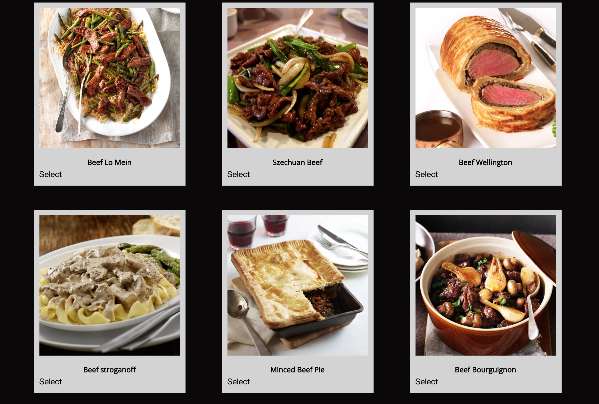

# What's for Dinner? 
As a person who needs to eat everyday, I would like some help with cooking or deciding what to eat. I want to have many choices of recipes, and when I can't decide on what to eat I will have a chance to pick a random recipe. On the day I don't feel like cooking or following recipes, I want to go out to eat, or in this COVID-19 seasons, get some to go from restaurant near me, I will be present with the top ten restaurant in my city. 

## Site Picture




# Table of Contents 
[Title](What's-for-Dinner )

[Site Picture](#Site-picture)

[Table of Contents](#Table-of-Content)

[Description of Page Building ](#Description-of-Page-Building)

[Code Snippet](#Code-Snippet)

[Technologies Used](#Technologies-Used)

[Deployed Link](#Deployed-Link)

[Authors](#Authors)

[License](#License)


## Description of Page Building 
* Create a html file, a css file, and a javascript file
  
* In HTML file 
  <ul>
  <li> Construct HTML file in semantic style 
  <li> Use Foundation CSS framework to style the page
  <li> Add images to jazz up the page 
  <li> Use flex box and grid tool for responsiveness
  <li> Create search box for user input 
  <li> Add authors info in the footer 
  </li>
    
* In Javascript file 
  <ul> 
  <li> Utilize TheMealDB and Zomato API 
  <li> Use AJAX function to pull data
  <li> Name variables as pointer to html file and for functions 
  <li> Create event listener for buttons to generate recipe info, recipe lists, and restaurant list
  <li> Validate user input 
  <li> Create HTML in semantic style 
    
* In Javascript file 
  <ul>
  <li>Name variables for different objects and function 
  <li>Set current date and time using Jquery 
  <li>Use on click function for save button to save user input in local storage 
  <li>Go throught the loops of objects by using the for loop to get the value of ingridients 
  <li>Apply JSON.stringify funtion to add into storage and JSON.parse to get items to the page
  </li>
  </ul>
* In Style.Css file 
  <ul>
  <li> Adjust texts, margin, and padding 
  <li> Add colors to elements 
  <li> Add background images 
  <li> Select font styles and sizes 
  <li> Use hover tools for buttons on images
  <li> Align cards side by side 
  </li>
  </ul>
## Code Snippet
Name contents using variables 
```javascript
var APIKey = "563492ad6f91700001000001f270577a46c942ff96c8a4e60398816d";
var recipeSTR = JSON.stringify(data);
var oldRecipeSTR = recipeData.meals[recipeIndex].strInstructions;
    
```

Use AJAX function to pull date
```javascript 
function getRecipes() {
    return $.ajax({
        url: "https://www.themealdb.com/api/json/v1/1/search.php?s=" + keywordSearch,
        method: "GET",
        cors: true,
        success: function(data) {
            var recipeSTR = JSON.stringify(data);
            recipeData = JSON.parse(recipeSTR);
            console.log("---- Recipe Data ----")
            console.log(recipeData);
        }
    })
}
```

Generate function that create html elements 
```javascript
function displayRandomRecipe() {
    console.log("displayRandomRecipe: " + randomData)
    $("#recipe").empty();
    $("#recipe").append(``);
    $("#recipe").append(`<h1 id="randomTitle" >${randomData.meals[0].strMeal}</h1>`);
    $("#recipe").append(`<h3 id="random-ingred" >Ingredients:</h3>`);
    var ingredList = $(`<ul id="ingredient-list"></ul>`);
    $("#recipe").append(ingredList);

```


Use on click function to attaches on click event to button element
```javascript 
$(document.body).on("click", ".recipe-button", function(event) {
    event.preventDefault();
    $("#recipe-list").empty();
    recipeIndex = $(this).attr("value");
    displayKeywordRecipe(recipeIndex);
});
  ```
Use conditional statement to place recipe in html accordingly 
  ```javascript 
     if (randomData.meals[0]["strIngredient" + (i+1)] === "" || null) {
            continue;
        } else {
            $("#ingredient-list").append(`<li>${randomData.meals[0]["strIngredient" + (i+1)] + " - " + randomData.meals[0]["strMeasure" + (i+1)]}</li>`);
        }
  ```


## Technologies Used
- HTML - used to create elements on the DOM
  * [HTML](https://developer.mozilla.org/en-US/docs/Web/HTML)
- CSS - styles html elements on page
  * [CSS](https://developer.mozilla.org/en-US/docs/Web/CSS)
- Javascript - gives interacticve elements to web pages
  * [Javascript](https://developer.mozilla.org/en-US/docs/Web/JavaScript)
- Jquery - use API to makes DOM traversal, manipulation, event handling, etc. simpler
  * [Jquery](https://jquery.com/)
- Git - version control system to track changes to source code
   * [Git](https://git-scm.com/)
- GitHub - hosts repository that can be deployed to GitHub Pages
  * [Github](https://github.com/)
- TheMealDb - An open database of recipes from around the world.
  * [theMealDb](https://www.themealdb.com/api.php) 
- Zomato- give data access to more than 1 million restaurants across 10,000 cities globally
  * [Zomato](https://developers.zomato.com/api) 
- Foudation - Responsive CSS frameworks 
  * [Foundation](https://get.foundation/)
- Micromodal - A lightweight, configurable and a11y-enabled modal library written in pure JavaScript
  * [Micromodal.js](https://micromodal.now.sh/)

## Deployed Link

* [See Live Site](https://vubao2303.github.io/Project-1/)


## Authors

* **Jordan Kelly** 
  - [Github](https://github.com/profjjk)
  - [LinkedIn](https://www.linkedin.com/in/jordan-kelly-3934a597/)
* **B Tram Vu**
  - [Github](https://github.com/vubao2303) 
  - [LinkedIn](https://www.linkedin.com/in/tram-vu-866250121/)
* **Jessny Joseph** 
  - [Github](https://github.com/jessnyj)
  - [LinkedIn](https://www.linkedin.com/in/jessny-joseph-361515201/)
* **Hudson Barnes** 
  - [Github](https://github.com/hudsonmbarnes)
  - [LinkedIn](https://www.linkedin.com/in/hudson-barnes-398483151/)


## License

© 2020 Trilogy Education Services, a 2U, Inc. brand. All Rights Reserved.

© 2021 TheMealDB. All Rights Reserved